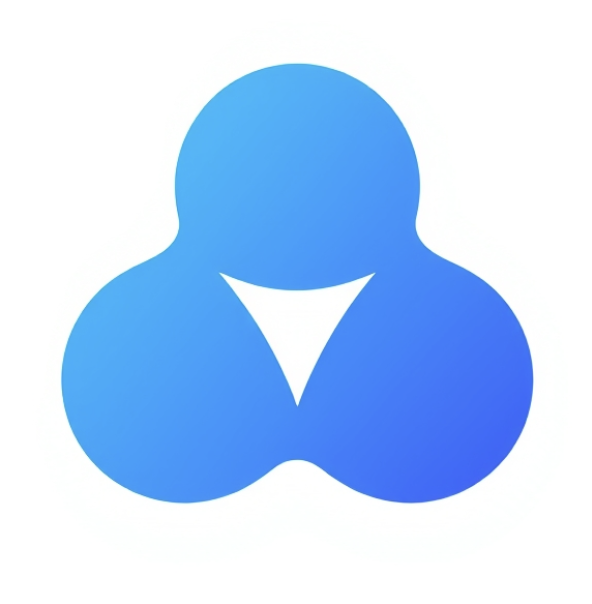

# 🎯 TakkApp - Conecta con Personas Increíbles

<div align="center">



**La app social para conectar con personas afines a través de actividades compartidas**

[](https://reactnative.dev/)
[](https://expo.dev/)
[](https://firebase.google.com/)
[](https://www.typescriptlang.org/)

</div>

---

## 📱 Sobre TakkApp

TakkApp es una aplicación social diseñada para conectar personas a través de **actividades compartidas** y un **sistema de matching semanal inteligente**. Ya sea que quieras hacer nuevos amigos, encontrar compañeros para actividades o simplemente expandir tu círculo social, TakkApp hace que sea fácil y divertido.

### ✨ Características Principales

#### 🎯 **Planes y Actividades**
- Crea y comparte actividades (deportes, cocina, arte, música, etc.)
- Únete a planes creados por otros usuarios
- Filtros por ciudad, fecha y tipo de actividad
- Sistema de cupos limitados por actividad
- Ubicaciones verificadas con Google Places

#### 💕 **Matching Semanal Mutuo**
- 3-5 matches personalizados cada semana
- Sistema bidireccional (si tú los ves, ellos te ven)
- Algoritmo basado en ubicación, edad y hobbies
- Chats automáticos cuando hay match mutuo
- Control total: pausa y reanuda cuando quieras

#### 💬 **Sistema de Chat**
- Chats individuales de matches
- Chats grupales por actividad
- Comunidades temáticas
- Notificaciones en tiempo real

#### 👤 **Perfiles Personalizados**
- Onboarding completo (5 pasos)
- Foto de perfil y galería
- Integración con Instagram
- Hobbies e intereses
- Actividades creadas

---

## 🏗️ Arquitectura

### **Stack Tecnológico**

```
Frontend:
├── React Native (0.76.5)
├── Expo (52.0.21)
├── TypeScript (5.3.3)
└── React Navigation

Backend:
├── Firebase Auth (autenticación)
├── Firestore (base de datos)
├── Firebase Storage (imágenes)
└── Cloud Functions (opcional)

APIs:
├── Google Places (ubicaciones)
└── Expo Notifications (notificaciones)
```

### **Estructura del Proyecto**

```
takkapp-v1/
├── app/                          # Pantallas principales (Expo Router)
│   ├── (tabs)/                   # Tabs principales
│   │   ├── index.tsx            # 🏠 Planes
│   │   ├── comunidad.tsx        # 💬 Comunidad/Chats
│   │   ├── matching.tsx         # 💕 Conectar
│   │   └── perfil.tsx           # 👤 Perfil
│   ├── onboarding/              # Flujo de onboarding (5 pasos)
│   ├── ActividadDetalle.tsx     # Detalle de actividad
│   ├── GroupChat.tsx            # Chat grupal
│   └── PerfilUsuario.tsx        # Perfil de otro usuario
│
├── src/
│   ├── components/              # Componentes reutilizables
│   │   ├── CustomTabBar.tsx    # Tab bar personalizado
│   │   ├── Input.tsx           # Input component
│   │   ├── Card.tsx            # Card component
│   │   └── ...
│   │
│   ├── features/               # Lógica de negocio
│   │   ├── auth/              # Autenticación
│   │   ├── matching/          # Sistema de matching
│   │   ├── posts/             # Actividades/planes
│   │   ├── groups/            # Chats grupales
│   │   └── onboarding/        # Onboarding
│   │
│   ├── hooks/                 # Custom hooks
│   │   ├── useActiveTab.ts
│   │   ├── useLocation.ts
│   │   └── useResponsive.ts
│   │
│   ├── constants/             # Constantes
│   │   ├── Colors.ts
│   │   └── activityTypes.js
│   │
│   └── utils/                 # Utilidades
│
├── assets/                    # Assets estáticos
│   ├── images/
│   │   ├── icons/            # Iconos personalizados
│   │   └── planes/           # Imágenes de actividades
│   └── fonts/
│
├── scripts/                   # Scripts de desarrollo
│   ├── migrate-to-weekly-matching.js
│   ├── populate-matching-users.js
│   └── ...
│
└── docs/                      # Documentación
```

---

## 🚀 Instalación y Configuración

### **Prerrequisitos**

- Node.js (v18 o superior)
- npm o yarn
- Expo CLI (`npm install -g expo-cli`)
- Cuenta de Firebase
- Cuenta de Google Cloud (para Google Places API)

### **1. Clonar el Repositorio**

```bash
git clone https://github.com/Kubolab-io/takkapp-v1.git
cd takkapp-v1
```

### **2. Instalar Dependencias**

```bash
npm install
```

### **3. Configurar Firebase**

1. Crea un proyecto en [Firebase Console](https://console.firebase.google.com/)
2. Habilita **Authentication** (Email/Password)
3. Crea una base de datos **Firestore**
4. Habilita **Storage** para imágenes
5. Copia tu configuración de Firebase

Crea el archivo `firebaseconfig.ts` en la raíz:

```typescript
import { initializeApp } from 'firebase/app';
import { getAuth } from 'firebase/auth';
import { getFirestore } from 'firebase/firestore';
import { getStorage } from 'firebase/storage';

const firebaseConfig = {
  apiKey: "TU_API_KEY",
  authDomain: "TU_AUTH_DOMAIN",
  projectId: "TU_PROJECT_ID",
  storageBucket: "TU_STORAGE_BUCKET",
  messagingSenderId: "TU_MESSAGING_SENDER_ID",
  appId: "TU_APP_ID"
};

const app = initializeApp(firebaseConfig);
export const auth = getAuth(app);
export const db = getFirestore(app);
export const storage = getStorage(app);
```

### **4. Configurar Google Places API**

1. Habilita **Places API** en Google Cloud Console
2. Crea una API Key
3. Actualiza `src/config/googlePlaces.js`:

```javascript
export const GOOGLE_PLACES_API_KEY = 'TU_GOOGLE_PLACES_API_KEY';
```

### **5. Configurar Reglas de Firestore**

Copia las reglas de `firestore.rules` a tu proyecto de Firebase:

```bash
firebase deploy --only firestore:rules
```

### **6. Iniciar la App**

```bash
# Desarrollo
npx expo start

# iOS
npx expo start --ios

# Android
npx expo start --android

# Web
npx expo start --web
```

---

## 📊 Colecciones de Firebase

### **`userProfiles`**
```javascript
{
  uid: string,
  displayName: string,
  email: string,
  photoURL: string,
  age: number,
  location: string,
  description: string,
  hobbies: string[],
  instagram: string,
  isPublic: boolean,
  hasMatchingConsent: boolean,
  matchingEnabled: boolean,
  createdAt: timestamp,
  updatedAt: timestamp
}
```

### **`posts` (Actividades)**
```javascript
{
  id: string,
  userId: string,
  author: string,
  title: string,
  content: string,
  activityType: string,
  location: string,
  locationData: {
    address: string,
    city: string,
    coordinates: { latitude, longitude }
  },
  date: timestamp,
  time: string,
  maxParticipants: number,
  currentParticipants: number,
  price: number,
  imageUrl: string,
  featured: boolean,
  createdAt: timestamp
}
```

### **`weeklyMatches`**
```javascript
{
  id: string,
  weekId: string,
  userId1: string,
  userId2: string,
  user1Data: { displayName, age, location, hobbies, ... },
  user2Data: { displayName, age, location, hobbies, ... },
  status: 'pending' | 'mutual',
  user1Accepted: boolean,
  user2Accepted: boolean,
  createdAt: timestamp,
  expiresAt: timestamp
}
```

### **`chats`**
```javascript
{
  id: string,
  participants: string[],
  participantData: { ... },
  type: 'match' | 'plan' | 'group',
  lastMessage: string,
  lastMessageTime: timestamp,
  createdAt: timestamp
}
```

---

## 🎨 Diseño y UX

### **Paleta de Colores**

```typescript
Colors = {
  primary: '#FFD97D',      // Amarillo principal
  accent: '#E9631A',       // Naranja acento
  background: '#FFFFFF',   // Blanco
  card: '#F8FAFC',        // Gris muy claro
  text: '#1a202c',        // Negro/gris oscuro
  blue: '#4A90E2',        // Azul para fondos
  blueLight: '#87CEEB',   // Azul claro
  success: '#4CAF50',     // Verde
  error: '#F44336',       // Rojo
  white: '#FFFFFF'
}
```

### **Custom Tab Bar**

Tab bar flotante personalizado con:
- Iconos personalizados (PNG)
- Animaciones de selección
- Efecto de floating
- Sombra y blur

### **Gradientes**

- **Blue Gradient**: Onboarding, Perfil, Detalles
- **Primary Gradient**: Botones principales

---

## 🔐 Seguridad y Privacidad

### **Autenticación**
- Email/Password con Firebase Auth
- Verificación de email (opcional)
- Onboarding obligatorio antes de usar la app

### **Privacidad de Datos**
- Perfiles públicos/privados
- Solo usuarios con consentimiento en matching
- Datos limitados compartidos en matches
- Chats privados y grupales seguros

### **Reglas de Firestore**
```javascript
// Solo usuarios autenticados pueden leer
allow read: if request.auth != null;

// Solo el propietario puede escribir
allow write: if request.auth != null && 
  request.auth.uid == resource.data.userId;
```

---

## 📱 Funcionalidades Detalladas

### **1. Onboarding (5 Pasos)**
1. **Información Básica**: Nombre y edad
2. **Ubicación**: Ciudad con Google Places
3. **Descripción**: Sobre ti
4. **Instagram**: Usuario de Instagram (obligatorio)
5. **Hobbies**: Selección de intereses

### **2. Crear Actividad**
- Título y descripción
- Tipo de actividad (lista predefinida)
- Ubicación con Google Places
- Fecha y hora
- Máximo de participantes
- Precio (opcional)
- Imagen (opcional)

### **3. Sistema de Matching**
- Generación automática cada lunes
- 3-5 matches por usuario
- Algoritmo de compatibilidad
- Estados: Pendiente, Aceptado, Mutuo, Rechazado
- Chat automático en match mutuo

### **4. Chats**
- **Individuales**: Match mutuo
- **Planes**: Grupo de participantes
- **Comunidades**: Grupos temáticos

---

## 🧪 Scripts Útiles

### **Desarrollo**

```bash
# Iniciar en desarrollo
npm start

# Limpiar cache
npx expo start -c

# Build para producción
npx expo build:ios
npx expo build:android
```

### **Firebase**

```bash
# Migrar a matching semanal
npm run migrate-weekly-matching

# Poblar usuarios de prueba
npm run populate-matching-users

# Limpiar datos malos
npm run cleanup-bad-plans
```

### **Testing**

```bash
# Test matching semanal
npm run test-weekly-matching

# Test cupos
npm run test-cupos
```

---

## 📚 Documentación Adicional

Consulta la carpeta `/docs` para documentación detallada:

- `SISTEMA_MATCHING_SEMANAL.md` - Sistema de matching
- `SISTEMA_CHAT.md` - Sistema de chats
- `SISTEMA_PERFILES.md` - Perfiles de usuario
- `CUPOS_SISTEMA.md` - Sistema de cupos
- `GOOGLE_PLACES_SETUP.md` - Setup de Google Places

---

## 🤝 Contribuir

Las contribuciones son bienvenidas! Por favor:

1. Fork el proyecto
2. Crea una rama para tu feature (`git checkout -b feature/AmazingFeature`)
3. Commit tus cambios (`git commit -m 'Add some AmazingFeature'`)
4. Push a la rama (`git push origin feature/AmazingFeature`)
5. Abre un Pull Request

---

## 📄 Licencia

Este proyecto es privado y propiedad de **Kubolab.io**.

---

## 👥 Equipo

Desarrollado con ❤️ por el equipo de **TakkApp**

---

## 📞 Contacto

- **Website**: [takkapp.com](https://takkapp.com)
- **Email**: soporte@takkapp.com
- **GitHub**: [Kubolab-io](https://github.com/Kubolab-io)

---

## 🎉 Agradecimientos

- [Expo](https://expo.dev/) - Framework de desarrollo
- [Firebase](https://firebase.google.com/) - Backend y autenticación
- [React Native](https://reactnative.dev/) - Framework mobile
- [Google Places](https://developers.google.com/maps/documentation/places/web-service) - API de ubicaciones

---

<div align="center">

**¿Listo para conectar con personas increíbles?** 🚀

[Descargar en App Store](#) | [Descargar en Google Play](#)

</div>
