# 📊 Diagrama del Sistema de Matching

## Flujo del Sistema de Matching Diario

```mermaid
graph TD
    A[Usuario abre pestaña Matching] --> B{¿Tiene match pendiente?}
    B -->|Sí| C[Mostrar match del día]
    B -->|No| D{¿Puede obtener nuevo match?}
    
    D -->|Sí| E[Seleccionar usuario aleatorio]
    D -->|No| F[Mostrar timer de 24h]
    
    E --> G[Crear match en Firebase]
    G --> C
    
    C --> H{Usuario decide}
    H -->|Aceptar| I[Actualizar estado: accepted]
    H -->|Rechazar| J[Actualizar estado: rejected]
    H -->|Ver Perfil| K[Navegar a PerfilUsuario]
    H -->|Enviar Mensaje| L[Sistema de mensajería]
    
    I --> M[Mostrar opciones de contacto]
    J --> N[Match rechazado - no reversible]
    
    M --> O[Timer de 24h activado]
    N --> O
    O --> P[Próximo match disponible]
    
    F --> Q[Mostrar cuenta regresiva]
    Q --> R{¿Timer = 0?}
    R -->|Sí| D
    R -->|No| Q
```

## Estructura de Datos

## Estados del Match

## Flujo de Tiempo

## Componentes de la UI

```mermaid
graph TB
    A[Pantalla Matching] --> B[Header con Timer]
    A --> C[Card de Match del Día]
    A --> D[Historial de Matches]
    A --> E[Información del Sistema]
    
    B --> B1[Título: 💕 Matching]
    B --> B2[Subtítulo: Match del día]
    B --> B3[Timer: Próximo match en Xh]
    
    C --> C1[Avatar del Usuario]
    C --> C2[Información Personal]
    C --> C3[Botones de Acción]
    C --> C4[Botones Secundarios]
    
    C1 --> C1A[Foto o Iniciales]
    C1 --> C1B[Badge: NUEVO]
    
    C2 --> C2A[Nombre y Edad]
    C2 --> C2B[Ubicación]
    C2 --> C2C[Descripción]
    C2 --> C2D[Hobbies]
    
    C3 --> C3A[❌ Rechazar]
    C3 --> C3B[💚 Aceptar]
    
    C4 --> C4A[👤 Ver Perfil]
    C4 --> C4B[💬 Enviar Mensaje]
    
    D --> D1[Scroll Horizontal]
    D --> D2[Cards de Matches Anteriores]
    
    E --> E1[¿Cómo funciona?]
    E --> E2[Instrucciones del Sistema]
```

## Algoritmo de Selección

```mermaid
flowchart TD
    A[Usuario solicita match] --> B[Obtener todos los usuarios públicos]
    B --> C[Filtrar usuario actual]
    C --> D[Filtrar usuarios ya matcheados hoy]
    D --> E{¿Hay usuarios disponibles?}
    
    E -->|No| F[Mostrar: No hay usuarios disponibles]
    E -->|Sí| G[Generar número aleatorio]
    G --> H[Seleccionar usuario por índice]
    H --> I[Crear match en Firebase]
    I --> J[Mostrar match al usuario]
    
    F --> K[Timer de 24h activado]
    J --> L[Timer de 24h activado]
    K --> M[Próximo intento en 24h]
    L --> M
```

## Seguridad y Privacidad

```mermaid
graph LR
    A[Usuario Autenticado] --> B{¿Es el propietario del match?}
    B -->|Sí| C[Permitir acceso]
    B -->|No| D[Denegar acceso]
    
    C --> E[Leer match]
    C --> F[Actualizar match]
    C --> G[Eliminar match]
    
    H[Perfil Público] --> I[Aparece en matching]
    J[Perfil Privado] --> K[No aparece en matching]
    
    L[Datos Sensibles] --> M[No se muestran en matching]
    N[Datos Públicos] --> O[Se muestran en matching]
```

---

**Estos diagramas muestran la arquitectura completa del sistema de matching implementado en Takkapp.** 📊
